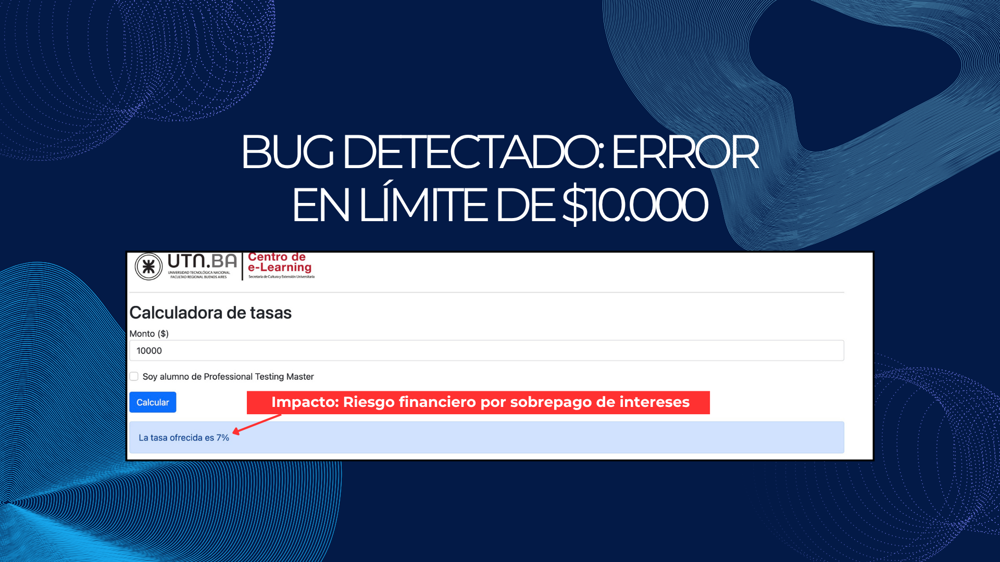

# QA-Testing-Calculadora-Bancaria
 ## Simulador de Tasas Bancarias - Banco Global S.A.

## 📌 Descripción del Proyecto
Este proyecto consiste en el proceso de **Testing Funcional** realizado sobre una aplicación móvil de simulación de plazos fijos. El objetivo principal fue validar la lógica de negocio aplicada a los diferentes rangos de inversión y los beneficios adicionales para alumnos de convenios específicos (PTM).

## 🛠️ Herramientas y Metodologías
* **Tipo de Testing:** Caja Negra (Black Box Testing).
* **Técnicas de Diseño:** Partición de Equivalencia y Análisis de Valores Límite (BVA).
* **Documentación:** Planilla de Casos de Prueba y Reporte de Errores (Defect Reporting).
* **Entorno:** Google Docs / PDF.

## 📊 Resumen de Ejecución
Se diseñaron y ejecutaron **4 Casos de Prueba**, obteniendo los siguientes resultados:

| ID | Caso de Prueba | Resultado |
| :--- | :--- | :--- |
| TC-001 | Validación Rango Bajo ($500) | ✅ Pass |
| TC-002 | Validación Rango Medio + Bono PTM | ✅ Pass |
| TC-003 | Validación Rango Alto ($15.000) | ✅ Pass |
| TC-004 | Análisis de Valor Límite ($10.000) | ❌ **Fail (Bug Detectado)** |

## 🐞 Bug Destacado
Durante la ejecución del **TC-004**, se detectó que el sistema asigna una tasa del **7%** al monto exacto de **$10.000**, cuando según los requerimientos de negocio, dicho valor debería estar incluido en el rango del **5%**. Este error representa un riesgo financiero de sobrepago de intereses por parte del banco.

  

## 📄 Documentación Completa
Puedes revisar el informe técnico detallado con capturas de pantalla y evidencias en el siguiente enlace:
👉 **[reporte/Reporte-Testing-Calculadora-Bancaria-Candela-Antognoli.pdf]**
